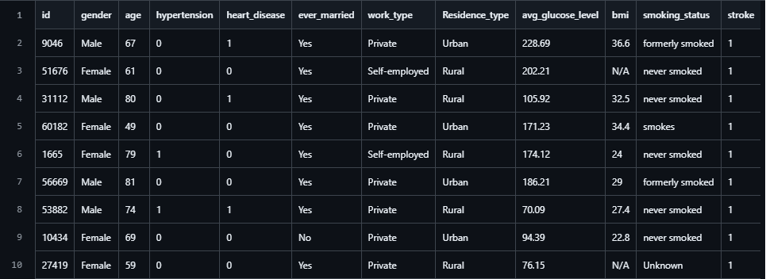

# 🧠 Análisis y Predicción de Accidentes Cerebrovasculares (ACV)

## 📖 Descripción del Problema

El Accidente Cerebrovascular (ACV) es una afección médica grave y una de las principales causas de mortalidad a nivel mundial. Ocurre cuando el suministro de sangre a una parte del cerebro se interrumpe o se reduce. 

* **El desafío:** Los ACV están vinculados a múltiples factores de riesgo combinados (edad, peso, tabaquismo, hipertensión). El problema radica en la dificultad de medir la influencia exacta de cada factor sin un análisis estructurado.
* **El objetivo:** Explorar este conjunto de datos médicos para identificar patrones y relaciones entre el estilo de vida, el historial clínico y la ocurrencia de un ACV.
* **Valor del proyecto:** Este análisis estadístico y exploratorio inicial establecerá una base sólida para comprender la distribución de los datos, paso previo fundamental para la futura construcción de modelos predictivos.

## 📊 Identificación de la Fuente de Datos

Los datos utilizados para este proyecto son de dominio público y provienen de una plataforma reconocida en la industria:

* **Plataforma:** Kaggle.
* **Dataset:** *Stroke Prediction Dataset*.
* **Formato:** Archivo `.csv` estructurado y procesable.
* **Volumen:** 5110 registros (pacientes anonimizados).
* **Variables:** 12 variables en total, abarcando datos cuantitativos (ej. nivel de glucosa, IMC) y cualitativos (ej. género, estado de tabaquismo, antecedentes médicos).

## 📂 Estructura del Repositorio

El proyecto está organizado de la siguiente manera:

* `Datos/`
    * `healthcare-dataset-stroke-data.csv` (Dataset principal)
* `dataset_medico.png` (Imagen gráfica del proyecto)
* `README.md` (Documentación principal)

## 👥 Equipo de Trabajo

Proyecto Integrador 2026 - Tecnicatura en Desarrollo de Software

* **Creado por Gastón Mauricio** | GitHub: [@GasmauC](https://github.com/GasmauC)
* **Nemesis Bracamonte** | GitHub: [@NemeBracamonte]
* **Marusich Leonardo** | GitHub: [@Maruthek1dd]
* **Virginia Varboza** | GitHub: [@VirBarboza]
* **Donata Delfini** | GitHub: [@usuario5]

---
*Materia: Estadística y Exploración de Datos | Primera Etapa: Entendimiento de los Datos*
